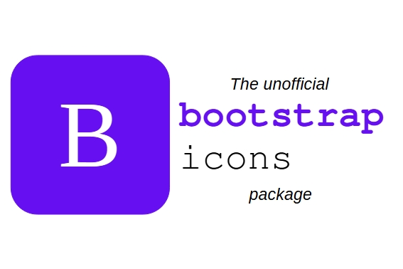

<p align="center">
  <a href="https://www.ctan.org/pkg/bootstrapicons">
    
  </a>
</p>

<h3 align="center">bootstrapicons</h3>

<p align="center">
  Icons from the framework Bootstrap
  <br>
  <a href="https://mirror.physik.tu-berlin.de/pub/CTAN/macros/latex/contrib/bootstrapicons/doc/bootstrapicons-documentation-full.pdf"><strong>Explore the docs »</strong></a>
  <br>
  <br>
  <a href="https://github.com/BenSt099/bootstrapicons/issues">Report bug</a>
  ·
  <a href="https://github.com/BenSt099/bootstrapicons/issues">Request feature</a>
</p>

## bootstrapicons

> **Warning**
This is _not_ an official package from Bootstrap.

## Usage

```tex
%%% Example file   
    \documentclass{article}
    
        \usepackage{bootstrapicons}

    \begin{document}

        \bicon{14}

        \bicon[scale=1.2,angle=90]{29}

\end{document}
```

## Documentation

The documentation can be viewed [here](https://github.com/BenSt099/bootstrapicons/blob/main/bootstrapicons/doc/bootstrapicons-documentation-full.pdf).

## Contributors

Thanks for all the feedback / comments / issues / contributions that made this package even better:

- [@cpierquet](https://github.com/cpierquet)

- [@rafa4mat](https://github.com/rafa4mat)

## Issues

In case of an issue, please provide a detailed description [here](https://github.com/BenSt099/bootstrapicons/issues).

## License

This project is licensed under the [MIT License](https://www.ctan.org/license/mit).